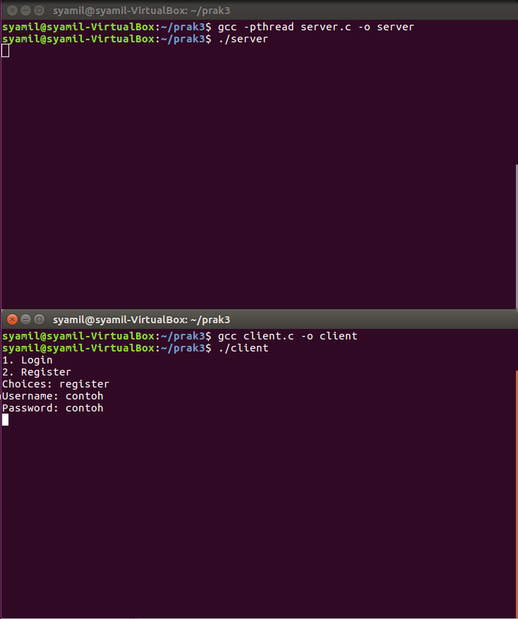
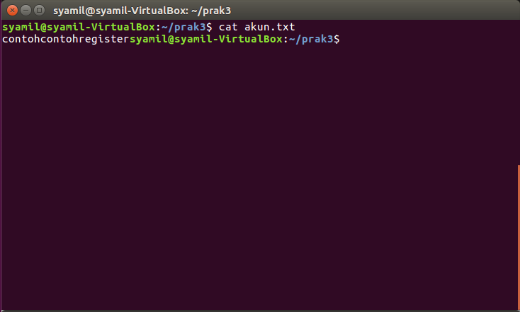

# SoalShiftSISOP20_modul3_D06


1. [Soal 1](#1-soal-1)
2. [Soal 2](#2-soal-2)
3. [Soal 3](#3-soal-3)
4. [Soal 4](#4-soal-4)


### 1. Soal 1
### 2. Soal 2 
Soal nomor 2 disuruh membuat game online berbasis text console dengan syarat menggunakan socket dan thread.
Untuk server side berikut adalah kodenya:
```sh
#include <stdio.h>
#include <sys/socket.h>
#include <stdlib.h>
#include <netinet/in.h>
#include <string.h>
#include <unistd.h>
#include <sys/types.h>
#include <unistd.h>
#include <wait.h>
#include <pthread.h>
#include <ctype.h> 
#include <limits.h>
#define PORT 8080

typedef struct akun{
		char username[100];
		char password[100];
		}akun;

pthread_t tid[100];

void *server(void *arg){
		int valread;
    int new_socket = *(int *)arg;
    char buffer[1024] = {0},buffer2[1024];
    FILE *pFile;
   	pFile = fopen("/home/syamil/prak3/akun.txt", "a+");
    while (1){
       char temp[512];
       akun daftar;
       
       valread = read(new_socket, buffer, 1024);
       if (strcmp(buffer, "register") == 0){
          valread = read(new_socket, daftar.username, 1024);
          valread = read(new_socket, daftar.password, 1024);
          fwrite(&daftar.username, sizeof(akun), 1, pFile);
          fwrite(&daftar.password, sizeof(akun), 1, pFile);
          fclose(pFile);
          send(new_socket, "register success", strlen("register success"), 0);
       }else if(strcmp(buffer, "login") == 0){
					valread = read(new_socket, daftar.username, 1024);
          valread = read(new_socket, daftar.password, 1024);
          pFile = fopen("/home/syamil/prak3/akun.txt", "r");
       		while(fgets(buffer2, 1024, pFile) != NULL){
       			if((strstr(buffer2, daftar.username)) && (strstr(buffer2, daftar.password)) != NULL){
       				printf("Auth success\n");
       				send(new_socket, "login success", strlen("login success"), 0);
       			}else{
       				printf("Auth failed\n");
       				send(new_socket, "login failed", strlen("login failed"), 0);
       			}
       		}
       		fclose(pFile);
       }
		}
}

int main(int argc, char const *argv[]) {
    int server_fd, new_socket;
    struct sockaddr_in address;
    int opt = 1;
    int addrlen = sizeof(address);
    char buffer[1024] = {0};
      
    if ((server_fd = socket(AF_INET, SOCK_STREAM, 0)) == 0) {
        perror("socket failed");
        exit(EXIT_FAILURE);
    }
      
    if (setsockopt(server_fd, SOL_SOCKET, SO_REUSEADDR | SO_REUSEPORT, &opt, sizeof(opt))) {
        perror("setsockopt");
        exit(EXIT_FAILURE);
    }

    address.sin_family = AF_INET;
    address.sin_addr.s_addr = INADDR_ANY;
    address.sin_port = htons( PORT );
      
    if (bind(server_fd, (struct sockaddr *)&address, sizeof(address))<0) {
        perror("bind failed");
        exit(EXIT_FAILURE);
    }

    if (listen(server_fd, 3) < 0) {
        perror("listen");
        exit(EXIT_FAILURE);
    }
		int i = 0;
		while(1){
    	if ((new_socket = accept(server_fd, (struct sockaddr *)&address, (socklen_t*)&addrlen))<0) {
        perror("accept");
        exit(EXIT_FAILURE);
    	}
    	pthread_create(&(tid[i]), NULL, &server, &new_socket);
    	i++;
    }
}
```
Pertama jika socket berhasil dibuat maka akan membuat thread yang berjalan mulai dari fungsi server. Pada fungsi server pertama akan membuka file akun.txt pada directory yang ditunjuk dengan mode akses append, file akan dibuat jika belum ada. Lalu menerima buffer dari client yang dimana adalah pilihan apakah user akan register atau login. Jika register maka akan memasuki if yang pertama dimana menerima username dan password dari client dan menyimpannya pada file yang telah ditunjuk menggunakan fwrite. lalu mengirimkan string register success kepada client.

Jika yang dipilih user merupakan register maka memasuki if selanjutnya. Pertama menerima username dan password dari client, lalu membuka file akun.txt dengan mode akses read. Kemudian memindahkan isi dari file yang ditunjuk ke buffer2 dan membandingkannya dengan username dan password yang diterima tadi. Jika ditemukan ada yang sama maka akan menampilkan pesan Auth success dan mengirimkan string login success ke client. Tetapi jika tidak ada yang sama maka menampilkan pesan Auth failed dan mengirimkan string login failed ke client.

Untuk client side berikut adalah kodenya:
```sh
#include <stdio.h>
#include <sys/socket.h>
#include <stdlib.h>
#include <netinet/in.h>
#include <string.h>
#include <unistd.h>
#include <arpa/inet.h>
#include <pthread.h>
#include <sys/types.h>
#include <sys/wait.h>
#include <sys/stat.h> 
#include <pthread.h>
#include <ctype.h> 
#include <limits.h>
#define PORT 8080

pthread_t tid[100];

void register_akun(char buffer[], int sock, int valread){
    char username[100] = {0};
    char password[100] = {0};
    printf("Username: ");
    scanf("%s", username);
    printf("Password: ");
    scanf("%s", password);
		send(sock, username, strlen(username), 0);
    send(sock, password, strlen(password), 0);
    
    valread = read(sock , buffer, 1024);
    printf("%s\n", buffer);
}

void login_akun(char buffer[], int sock, int valread){
    char username[200] = {0};
    char password[100] = {0};
    printf("Username : ");
    scanf("%s", username);
    printf("Password : ");
    scanf("%s", password);
		send(sock, username, strlen(username), 0);
    send(sock, password, strlen(password), 0);

    valread = read(sock , buffer, 1024);
    printf("%s\n", buffer);
}

int main() {
    struct sockaddr_in address;
    int sock = 0, valread;
    struct sockaddr_in serv_address;
    int command;
    char buffer[1024] = {0};
    if ((sock = socket(AF_INET, SOCK_STREAM, 0)) < 0){
        printf("\n Socket creation error \n");
        return -1;
    }

    memset(&serv_address, '0', sizeof(serv_address));

    serv_address.sin_family = AF_INET;
    serv_address.sin_port = htons(PORT);

    if(inet_pton(AF_INET, "127.0.0.1", &serv_address.sin_addr)<=0) {
        printf("\nInvalid address/ Address not supported \n");
        return -1;
    }


    while(1) 
    {
        if (connect(sock, (struct sockaddr *)&serv_address, sizeof(serv_address)) < 0) 
        {
            printf("\nConnection Failed \n");
            return -1;
        }
        char buffer[1024] = {0}, buffer2[1024] = {0};
        printf("1. Login\n2. Register\nChoices: ");
        scanf("%s", buffer);
        send(sock, buffer, strlen(buffer), 0 );
        if (strcmp(buffer,"login") == 0)
        {
           login_akun(buffer2, sock, valread);
        }else if(strcmp(buffer,"register") == 0){
           register_akun(buffer2, sock, valread);
        }
    }
    return 0;
}
```
Pertama jika socket berhasil dibuat akan menampilkan pilihan berupa login dan register, lalu user diminta menginputkan pilihannya dan mengirimkannya ke server. Jika yang dipilih user adalah login maka akan menjalankan fungsi login_akun dan jika yang dipilih register akan menjalankan register_akun. Untuk fungsi login_akun dan register_akun hampir sama dimana akan meminta memasukkan username dan password lalu mengirimkannya ke server. Yang membedakan adalah untuk register akan menerima string register success dari server, sedangkan untuk login akan menerima string login success atau login failed dari server.




**Kendala:** Pengerjaannya belum selesai dan masih error.
### 3. Soal 3
### 4. Soal 4
#4a.
nomer 4a meminta untuk membuat perkalian matriks, matriks 4x2 dikalikan dengan matrik 2x5, dimana hasil dari program ini akan digunakan nomer 4b, soal mempunyai syarat yaitu harus menggunakan share memory dan isi dari matriks harus di definisikan
```sh
int main() {
    int inputa[4][2], inputb[2][5], output[4][5], *shm_ptr, sum = 0;

    	key_t kunci = 1234;
    	//shmget(key_t key, size_t size, int shmflg);
    	int shmid = shmget(kunci, sizeof(int), IPC_CREAT | 0666);
	//error handling
	if (shmid < 0) {
     		printf("*** shmget error (server) ***\n");
     		exit(1);
	}
   	shm_ptr = shmat(shmid, NULL, 0);
	//error handling
	if (*shm_ptr == -1) {
    		printf("*** shmat error (server) ***\n");
     		exit(1);
	}
```
mendefinisikan key untuk digunakan di fungsi shmget,
shmget berfungsi untuk mengalokasikan segment untuk share memory
mendefinisikan shmid = shmget untuk digunakan di fungsi shmat
shmat berfungsi untuk memanggil agar share memory dimulai, dan ```sh if (*shm_ptr == -1)``` untuk handling error 
```sh
//input mariks a
    	for (int i = 0; i < 4; i++){
    		for (int j = 0; j < 2; j++){
    	    		inputa[i][j]=1;
		}
	}
	//input matriks b
	for (int k = 0; k < 2; k++){
    		for (int l = 0; l < 5; l++){
    	    		inputb[k][l]=1;
		}
	}
	//untuk menghitung perkalian matriks
	for (int c = 0; c < 4; c++) {
		for (int d = 0; d < 5; d++) {
        		for (int x = 0; x < 2; x++) {
         			sum = sum + inputa[c][x] * inputb[x][d];
       			 }
 
        	output[c][d] = sum;
        	sum = 0;
		}
    	}
```
kodingan template untuk menghitung perkalian matriks
```sh
	//untuk menprint hasil perkalian
	for (int w = 0; w < 4; w++) {
        	for (int s = 0; s < 5; s++) {
            		*shm_ptr = output[w][s];
           		sleep(1);
           		printf("%d\n", *shm_ptr);
        	}
    	}

    shmdt(shm_ptr);
    shmctl(shmid, IPC_RMID, NULL);
    
    return 0;
}
```
pengulangan diatas digunakan untuk menampilkan hasil perkalian dari kedua matriks
```sh *shm_ptr = output[w][s];``` deklarasi ini digunakan untuk fungsi shmdt mengoper hasil dari perkalian yang nanti akan digunakan di nomer 4b

#4b.
4b meminta untuk menampilkan hasil dari program 4a, dan memfaktorialkan hasil tersebut akan tetapi faktorial tersebut mempunyai syarat hasilnya tidak di kali, akan tetapi di jumlah. dan harus menggunakan thread
```sh
void main(){
        key_t kunci = 1234;
        int *shm_ptr;
        int arr[20];
        int hasil;
        int shmid = shmget(kunci, sizeof(int), IPC_CREAT | 0644);
        shm_ptr = shmat(shmid, NULL, 0);
	//error handling
	if (*shm_ptr == -1) {
     		printf("*** shmat error (server) ***\n");
     		exit(1);
	}
        pthread_t tid[20];
```
deklarasi sama seperti 4a untuk kebutuhan share memory
kondisi ```sh if (*shm_ptr == -1)``` digunakan untuk error handling
deklarasi thread sebanyak 20 karena jawaban dari 4a sebanyak 20

```sh
 for (int j = 0; j < 20; j++){
                arr[j] = *shm_ptr;
                //hasil = arr[j];
                pthread_create(&tid[i], NULL, &playandcount, (void*)arr[j]);
                i++;
                sleep(2);
		//FUNGSI UNTUK PRINT LAYPUT MATRIX
                if((j+1) % 5 == 0){
                        printf("\n");
                } else {
                        printf("\t");
                }
        }
```
pengulangan sebanyak 20, karena thread yang diinginkan harus sesuai dengan hasil dari 4a (sebanyak 20), 
mendeklarasikan array untuk menyimpan salah satu nilai dari 20.
mendeklarasikan fungsi thread dimana memanggil fungsi playandcount dan mempassing salah satu nilai dari jawaban 4a.
terdapat kondisi ```sh if((j+1) % 5 == 0)``` untuk format print layout matriks
```sh
void playandcount(int n){
    int output=0;

    for(int x = n; x >= 1; x--){
        output += x;
    }

    printf("%d", output);
}
```
fungsi playandcount terdapat pengulangan untuk menghitung faktorial dari nilai yang di passing
```sh output += x;``` untuk menjumlahkan hasil yang sudah difaktorialkan
```sh
for(int k = 0; k < i; k++){
            pthread_join(tid[k],NULL);
        }
        shmdt(shm_ptr);
        shmctl(shmid, IPC_RMID, NULL);

}
```
pengulangan untuk menjoinkan smua thread yang ada

#4c.
Maksud soal nomer 4c adalah soal meminta untuk menghitung banyaknya file di directory yang sedang berlangsung, untuk mengecek banyaknya file yang ada yaitu menggunakan ```sh "ls | wc -l"```. 
```sh
int main() 
{ 
	int pipa[2];
	pipe(pipa);
	char *als[] = {"ls", NULL};
	char *awc[] = {"wc", "-l", NULL}; ;
	pid_t p; 
	p = fork();
```
deklarasi pipe, fungsi ls dan wc, dan fork
```sh
//childfork
	if (p == 0){
 
		dup2(pipa[1], 1);
        	close(pipa[0]);
        	close(pipa[1]);

	
        execv("/bin/ls", als);

	} 
  ```
childfork disini sebagai input karena pipe di [1] mempunyai tugas yaitu write, tugas ls disini yaitu membuat list file yang terdapat di directory yang sedang berlangsung
  ```sh
	else //parent fork 
	{ 

		dup2(pipa[0], 0); 
        	close(pipa[0]);
        	close(pipa[1]);
	
	//prints the line count 
	//word count per kata
        execv("/usr/bin/wc", awc);
	exit(0); 
	} 
} 
```
didalam parent fork, terdapat pipe[0] mempunyai tugas yaitu read, tugas wc ini adalah menghitung per kata file yang terdapat di directory yang sedang berlangsung
